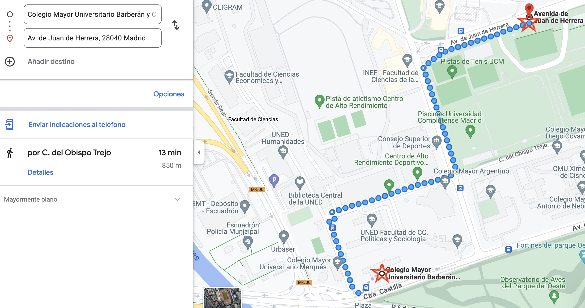

# :mega: :mega: :mega: __Tired of taking the subway after classes? Using public bikes has never been so easy!__


After a long day at university, getting on the subway packed with all your classmates is the last straw that broke the camel's back. I suggest you a bike ride home, you do sport and relax at the same time.

Where the metro stop is located is very controlled and it may seem easy to resort to it. 

*What if I told you that after this project, whatever university you are in, you will be able to locate your nearest bike park or bike station?*

You will also know the exact distance from it, in case you want to call your mother on the way :see_no_evil:


## :boom: **Concepts and objetives**

I have three data sources: 
1. Universities of Madrid
2. Bicimad Stations
3. Bicipark Stations

Bicimad and Bicipark where two given csvs whereas universities of Madrid data were collected from [Link](https://datos.madrid.es/portal/site/egob) .

We must create a Python App (**Data Pipeline**) that allow their potential users to find the nearest BiciMAD or Bicipark station to a university chosen or just the list resume with all universities and nearest station if they wish.


### :bulb: Usage

As user, you have to pick if you prefer biciMAD or biciPARK. 

Then, you write the university from Madrid you are looking for (e.g. : Colegio Mayor Barberán y Collar) and this is how your response will look like 

| Address     | Distance | 
| :----------: | :---:    | 
| Avenida Juan de Herrera frente a la calle Paul Guinard | 606.651906      | 



### :wrench: **Configuration**

Libraries used:
- pandas
- argparse
- requests
- geopandas

### :hammer: __Technology stack__

I prepared and test my project in the development notebook using Jupyter.

I created main3.py and module.py files with all the functions and parameters included in the development notebook, in order to finish the Pipeline via Visual Studio Code. 

To my understanding I divide module.py in bicimad.py and bicipark.py. Then, in main3.py I call them independently.

### :file_folder: **Folder structure**
```
└── ih_datamadpt0923_project_m1
    ├── _wip_
    ├── data
    │     ├── bicimad_stations.csv
    │     ├── bicipark_stations.csv
    │     └── solution
    │            ├── bicimad_solution.csv
    │            └── bicipark_solution.csv
    ├── modules 
    │     ├── __init__.py
    │     ├── bicimad.py
    │     ├── bicipark.py
    │     └── geo_calculations.py
    │    
    ├── notebooks
    │     ├── dev_notebook_bicimad.ipynb
    │     └── dev_notebook_bicipark.ipynb
    │     
    ├── LICENSE
    ├── foto_metro.jpeg
    ├── main3.py
    └── p1_README.md
   
```


## Hope you like it!
